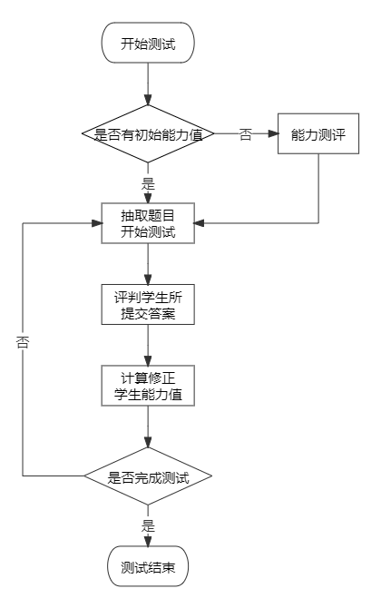

# 项目介绍

## 基本概况

本项目是[@Ethan](https://github.com/Ethan0622)的本科毕业设计，主要用于杭州师范大学《现代教育技术》公选课的期末考试。

## 开发背景

《现代教育技术》公选课以往的期末考试形式是上机完成一份指定课文的信息化教学设计，现在使用本考试系统可以进行在线考试，通过单项选择题、
判断题、名词解释、简答题、论述题等多种题型从多方面多角度进行期末考评。

当然，考试过程中并不是简单的随机出题考查，而是能根据你的答题情况，自适应的从题库中抽题。简单来说，在你考试过程中，本系统会对你的能力值进行测算，
根据能力值抽取最适合你作答的题目。实际抽题还会考虑更多因素，最基本的原理就是这样。

## 自适应测试流程

一场自适应考试的基本流程如下：

