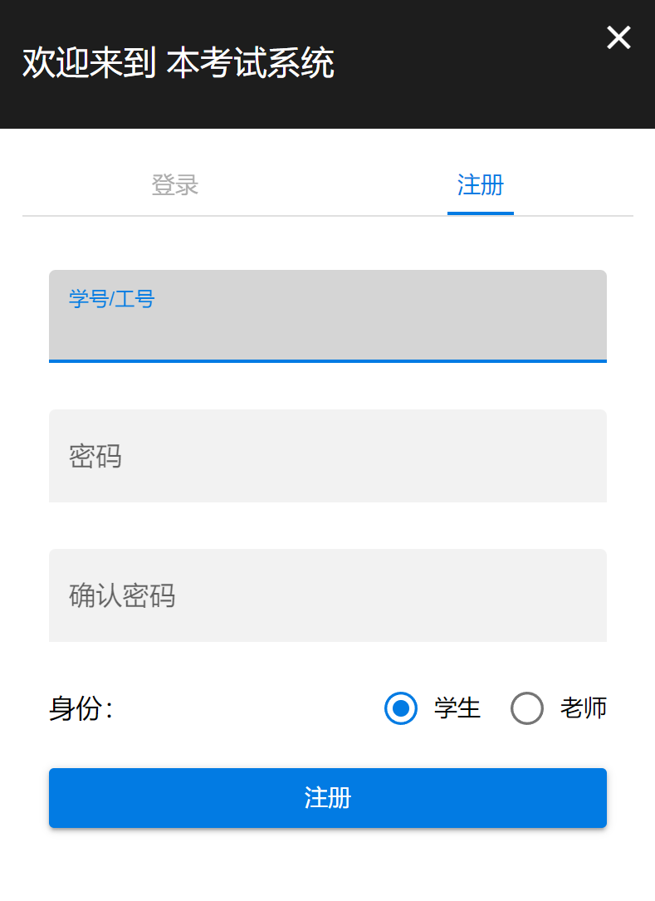

# 学生

你来了，欢迎！

学生么，使用本系统肯定是来考试的，先祝你考个考成绩。

我将给你介绍以下几个方面：考试、班级、应试技巧

[[toc]]

## 考试

自适应考试，不多说了，一时半会给你解释不清，做题就完事了。

真的感兴趣，请移步[Google Scholar](https://scholar.google.com/)

还是来讲讲怎么进行考试吧。

### 1. 注册并登录

注册用自己的学号，密码随意，请一定记住。
目前没有“忘记密码”功能，也没有各种手机、邮箱的验证。（主要是没钱:sweat:）

登录以后，最好改一下自己的真实姓名，现在不改，我相信之后你的任课老师也会要求你改的，因为光看学号很难一下就知道你是谁。

### 2. 进行测试

点击首页按钮“**进行测试**”，首先需要确定考试设置（做哪些题，每种题型做几题）。

提供两种方式，使用现有预设或直接自定义。

一定要**按你的老师**要求进行设置，并且不要**选错**、**填错**，不然你这次考试就作废了。

设置完之后，请开始考试吧。

Tip：

1. 考试时间限时 2 小时；

2. 看清题目，认真作答，每道题一次答题机会，提交即评分，没有改的机会；

3. 中途退出小心被抓住:sunglasses:

### 3. 查看考试结果

考完试即可查看考试结果，刺不刺激，当场出分哦:grinning:

当然，只评价了客观题，系统基于你的客观题答题情况，估算了你的能力值。不要太在意高或低，更多关注下面的答题回顾。

主观题还需要你的任课老师来评价。主观题如果能自动评分就好了，可惜暂时做不到。

## 班级

默认使用本系统的人都是这学期上《现代教育技术》课的同学。

正经人，谁不上这个课还来考试的。不要动歪脑筋，给我这系统搞破坏，崩了让你来修嗷。

所以，我们来考试的同学肯定都有一个班级，本系统也提供了班级功能，请你加入自己任课老师的班级。

这样，你的考试记录他才能看到，才能给你期末评分，你这门课**才有成绩**，**才能修到学分**，**才能毕业**。

所以登录之后，先加入班级再说。

问：怎么加入班级呢？

答：问你的任课老师，班级邀请码是多少，输入班级邀请码就能加入班级。

## 应试技巧

一进来就看这个了？很积极啊！

抓起来！

当然没有什么应试技巧，连作弊都很难，毕竟你的同学和你考的题目根本不一样。

**好好复习，多看书或老师的 ppt**才是王道。

考的题目大部分来自书本的，前提是你们老师用的书和我是同一本。
