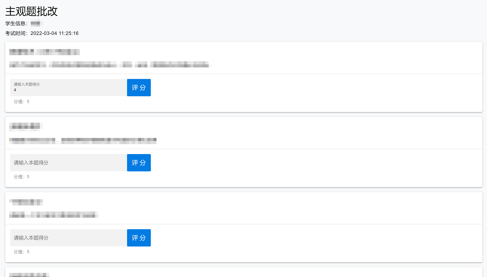

# 教师

老师好，欢迎您使用本考试系统。接下来我将从基本使用、试题管理、班级管理这几个方面进行介绍，以帮助您快速上手使用。

[[toc]]

## 基本使用

同样的，老师要使用本系统，请先注册登录自己的账号。注册用工号，密码自定，记得身份一定要选“**老师**”。

第一次登录后，最好修改更新一下自己的个人信息，方便学生查看。

教师主要在“**教师控制台**”进行操作，点击右上角下拉列表内的按钮进入。

可以看到，教师控制台左侧栏是功能选项区域，右侧是内容显示区域。教师控制台里就提供了**试题管理**与**班级管理**。

## 试题管理

教师能够管理后台试题库的试题，查看试题、删除试题、修改试题、新增试题都可以。

### 查看试题

系统根据题型将所有试题分类，点击不同题型即显示该题型的全部试题，列出了试题的题干、难度系数等信息。

同时还有两个按钮，“**查看**”与“**删除**”。

点击“**查看**”即可查看某一题的更多详细信息。

### 删除试题

若要删除试题只需点击“**删除**”按钮，在弹出的对话框中点击“**确定**”即可。

### 修改试题

在查看试题库中已有的某一题的详情时，可以对试题的各种参数进行**更新**。

### 新增试题

点击左侧“添加试题”进入试题添加页面，目前有两种方式：**逐题添加**与**批量添加**。

#### 逐题添加

添加步骤：

1. 在上方的下拉列表中选择你要添加的题型（单项选择题、判断题、名词解释、简答题、论述题）；

2. 填写好下方的各种题目信息；

3. 点击“**上传**”即可。

#### 批量添加

批量添加需要上传含有题目的 Excel 文件。

**重要提醒**：请务必使用系统提供的 Excel 模板，并且按照要求填写题目信息，文件中存在任何不规范的地方都会导致添加试题失败。

点击“**点击下载模板**”按钮下载 Excel 模板

填写说明可以看下载的压缩包内的 PDF 文件，或[在线查看](./uploadItem.md)

## 班级管理

班级管理提供创建班级、管理学生等功能。

### 创建班级

点击左侧“**创建新的班级**”按钮，在弹出的对话框中输入班级的名字即可创建班级。

创建完成后，即可进入班级详情页面，里面有**班级邀请码**、**班级学生**等各种信息。

**班级邀请码**：一个 8 位的随机码，可以提供给学生，学生输入邀请码即可加入该班级；

### 管理学生

班级内学生的管理包括添加学生、帮助学生重置密码、查看学生测验情况、批改主观题等功能。

#### 添加学生

为提高效率，教师可以直接帮助任教班级的学生创建账号并直接加入自己的班级中。

和批量添加试题类似，通过上传 Excel 文件来创建学生账号，系统也提供规范的 Excel 模板，麻烦老师下载后填写上传。

**重要提醒**：请务必使用系统提供的 Excel 模板，并且按照要求填写用户信息

**创建的账号默认密码是 123456，也请老师提醒学生及时修改密码。**

填写说明可以看下载的压缩包内的 PDF 文件，或[在线查看](./uploadStudent.md)

#### 重置密码

点击“**编辑修改**”按钮，即可在弹出的对话框中，帮学生重置密码。

甚至，直接将该学生**踢出班级**也是可以的。

#### 查看测验情况

教师可以查看班级内学生的测验情况，点击一个学生的“点击查看”按钮，可以看到学生的所有测验记录。

#### 批改主观题

由于主观题自动评分目前没有实现，所以主观题需要教师进行批改。

在查看学生的测验记录中，最后一列有“**进行批改**”按钮，点击即可对该学生该次考试的主观题答案进行评分。

